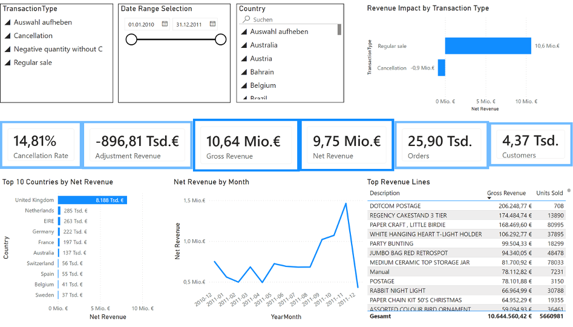
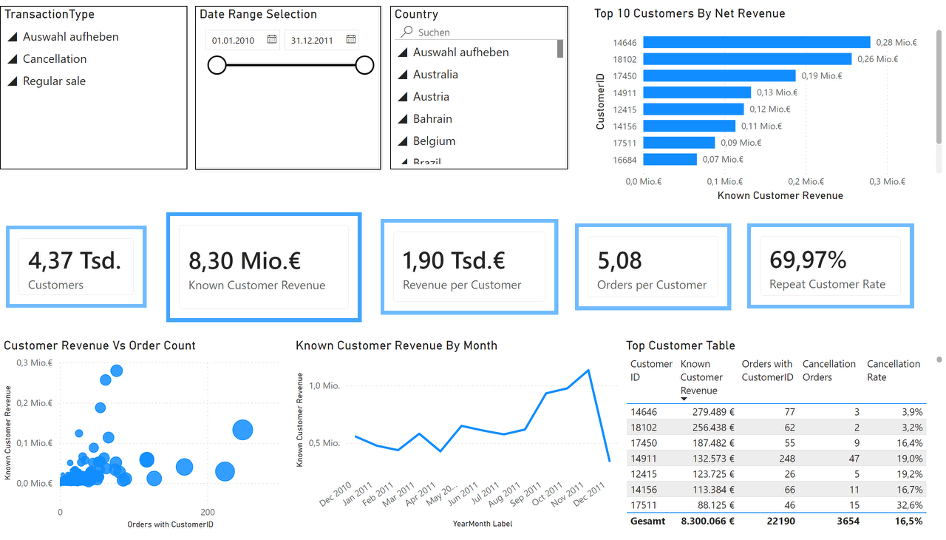
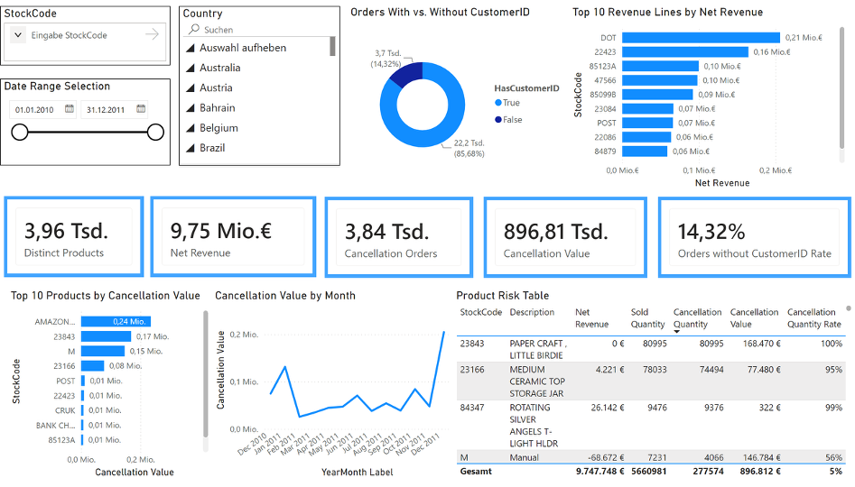

# Business Operations & KPI Governance Case

**Power BI · SQL · KPI Logic · Data Quality · Business Analysis**

This project demonstrates how raw online retail transaction data was cleaned, modeled, visualized and validated to support business decisions.

## Final Case Dossier

[Download the full PDF dossier](./case-dossier.pdf)

## Dashboard Preview

### Executive Overview

### Customer & Revenue Deep Dive

### Product & Cancellation Risk

## Key Skills

- Power BI Service
- Power Query
- DAX
- SQL
- SQLite
- Python / pandas
- KPI Definition
- Data Quality
- Star-Schema-Oriented Modeling
- Business Analysis

## Key Findings

- Gross Revenue: approx. 10.64m €
- Net Revenue: approx. 9.75m €
- Adjustment Revenue: approx. -896.81k €
- Cancellation Rate: approx. 14.81%
- Known Customer Revenue: approx. 8.30m €
- Orders without CustomerID Rate: approx. 14.32%

## SQL Validation

Selected dashboard metrics were reproduced with SQL in SQLite to validate the Power BI results directly on transaction-level data.

[View SQL validation notebook](./sql-validation-notebook.ipynb)

## Application Purpose

This repository is part of an application portfolio for Data Analyst, BI Analyst, Business Analyst and Operations Analyst roles.
